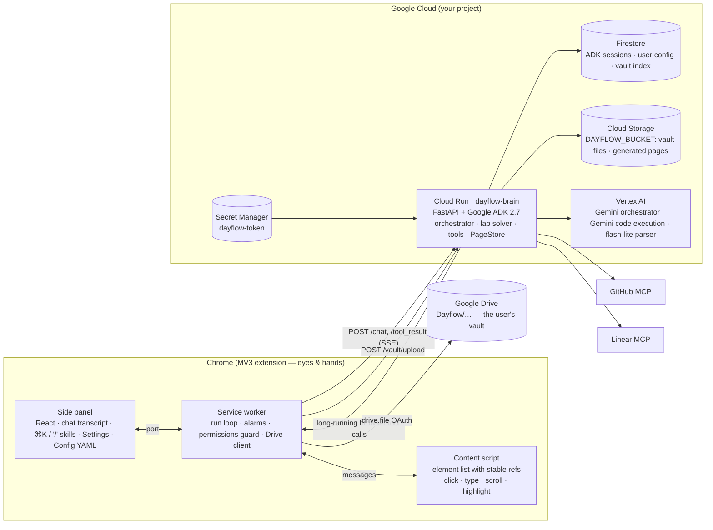

# Dayflow — a browser agent on Gemini, with the config you own

Dayflow is a Chrome side-panel agent with a Gemini brain (Google ADK on Cloud Run). It works where you already work — signed in to your university portal, Telegram, GitHub — and runs multi-step chores end to end: syncing course files into your Google Drive vault, solving a lab into a runnable notebook and a private repo, posting the weekly update to the team chat and filing the issues and the PR.

It is built like a coding agent, but for the browser: a generic loop plus **user-owned configuration** — *skills* (playbooks), *site profiles* (notes per domain, with a perception mode), *permissions* (navigation allow-list, ask-before gates), *connections* and *schedules*. Everything university-specific ships as a default **skill pack** (`backend/dayflow/core/packs/kbtu-student.yaml`); nothing in the code knows what a specific portal is.

**Track:** The Taskmaster · **Submission:** All Things Agentic Hackathon (Google, 2026)

## What it does (demo scenes)

| # | Skill | What Gemini does | Harness verdict (`make e2e`) |
|---|---|---|---|
| 1 | **Vault sync** | Opens the portal, walks School → Instructor → course folder, downloads every file into Drive `Dayflow/<course>/<Materials\|Week NN\|Lab NN>/`, the brain parses each (summary, deadlines) and indexes it. Runs on a schedule too. | see `harness/out/vault-sync.json` (status table below) |
| 2 | **Lab** | Reads the lab PDF from the vault, solves every task with code that is actually run (Gemini code execution), assembles a notebook with real outputs, writes a report, creates a private GitHub repo and pushes README/TODO/notebook/report; saves the report page to the vault. | `harness/out/lab.json` |
| 3 | **Team ops** | Summarises the week from the repo, opens the messenger, finds the team chat, asks you to approve the exact text, sends it; files Linear issues; opens a GitHub issue + PR. | `harness/out/team-ops.json` |
| 4 | Courseware | Cheatsheet + quiz page from the syllabus, opened in a tab, saved to Drive. | not built yet |
| 5 | Scaffold | Week/lab folder tree in Drive from the syllabus schedule. | not built yet |
| 6 | Pitch deck | `.pptx` + HTML preview from the repo, saved to Drive. | not built yet |

Every run streams into the side panel as a transcript: one sentence of reasoning before each action, the tool row with its result, timing and a screenshot thumbnail, artifacts (Drive files, pages, repos, PRs), and **Allow / Deny** cards for anything outward-facing.

### Current status (honest)

| Scene | Last fake-harness run | Result |
|---|---|---|
| vault-sync | `harness/out/vault-sync.json` | see "Harness" below — the table is filled from the JSON's `pass`/`failures` |
| lab | `harness/out/lab.json` | idem |
| team-ops | `harness/out/team-ops.json` | idem |
| courseware, scaffold, pitch-deck | — | tools (`generate_courseware`, `plan_vault_folders`, `build_deck`) do not exist yet; the pack skills are placeholders |

The deployed Cloud Run revision is only as new as the last `make deploy-brain`; `make deploy-smoke PROJECT=…` tells you whether the v2 routes (`/vault`, `/pages`) are live on it.

## Architecture



**How a run works.** The panel posts the prompt to `/chat`. The ADK orchestrator composes its instruction from the user's config (base prompt + active skill or every skill as a playbook + site profiles in scope with their `dom`/`vision` mode + permissions) and streams events over SSE. When the model calls a *browser* tool, ADK's long-running-tool mechanism ends the turn; the extension executes it (`read_page`, `click`, `download`, …), attaches a JPEG of the tab when *Vision* is on, and posts the result to `/tool_result`, which resumes the same session. Each HTTP exchange is short and instance-agnostic, so the brain scales to zero. Server tools run inside the brain: vault (`vault_list` / `vault_read`, PDF parsing with Gemini), the lab solver (an `LlmAgent` with `BuiltInCodeExecutor` wrapped as an `AgentTool`), `build_notebook` / `build_report` (nbformat + a rendered page at `/pages/report/<id>`), GitHub and Linear via `McpToolset` — or in-process fakes when `DAYFLOW_FAKE_CONNECTORS=1`.

**Vault.** Two modes, chosen in Settings → Vault. *Google Drive*: the extension uploads each file to your own Drive (`chrome.identity`, scope `drive.file`) **and** posts the bytes to `POST /vault/upload` so the brain can parse and index them (Firestore `users/{uid}/vault/{id}`, bytes in `DAYFLOW_BUCKET`). *Brain only*: no OAuth client needed (judges, CI) — files live in the brain and are listed at `GET /vault`.

**Safety model.** Permissions are enforced twice. In the brain (`before_tool_callback`): host allow-list for `navigate` / `open_tab` / `download(url=…)` (the brain's own host is implicitly allowed for the pages it generates), a hard cap of 40 browser actions per run, and **bound approvals** — a tool in `ask_before` (`type`, `create_issue`, `issue_write`, `create_pull_request`, `run_js`) only runs when the user allowed a `request_confirmation` card whose text covers exactly the content the call sends (the message text, the issue title/body, the JS expression); an approval is spent by that one call. In the extension: URL scheme + allow-list on every URL the model passes **and on the tab every action targets** (the active-tab fallback, redirects, links that leave the site are refused), downloads re-checked after redirects, vault-confined paths, `run_js` printed in full in the transcript and gated by an Allow card when it can move data, password / card / one-time-code values masked in `read_page`. Model-written lab code runs in Gemini's sandbox; the brain refuses to run it locally on Cloud Run (`K_SERVICE` set) unless `DAYFLOW_LOCAL_EXEC=1`. Page content is declared untrusted in the system prompt. `/pubsub` and `/cron` verify Google OIDC tokens; the extension's bearer token cannot call them.

## Google Cloud usage (hackathon gates)

| Requirement | Where |
|---|---|
| Gemini via Vertex AI | orchestrator, lab solver (code execution), flash-lite parser — `backend/dayflow/models/models.yaml`, `GOOGLE_GENAI_USE_ENTERPRISE=1`; `/health` shows the configured backend |
| Google Agent Framework | Google ADK 2.7 (`LlmAgent`, `LongRunningFunctionTool`, `AgentTool` + `BuiltInCodeExecutor`, `McpToolset`, callbacks, `FirestoreSessionService`) — `backend/dayflow/agents/`, `backend/dayflow/tools/` |
| Cloud infrastructure | Cloud Run (brain), Firestore (sessions, config, vault index), Cloud Storage (vault + pages), Secret Manager (token). Pub/Sub push (`/pubsub`) and Cloud Scheduler (`/cron`) handlers exist in the brain but no Make target deploys a worker or a scheduler job yet. |

## Repository layout

```
extension/            Chrome MV3 extension (WXT 0.21 · React 19 · Tailwind 4 · TypeScript)
  entrypoints/        background.ts (run loop, alarms, config sync) · content.ts (eyes & hands) · sidepanel/
  src/protocol.ts     wire protocol + settings model (sites, permissions; skills come from the brain)
  src/agent/          adk.ts (ADK event adapter, SSE) · live.ts (tool loop) · tools.ts (browser tools + Drive/vault upload)
                      guard.ts (client-side permissions) · confirm.ts · drive.ts · identity.ts · sync.ts · cron.ts · scheduler.ts
  src/ui/             Chat · Timeline · Composer · CommandPalette · Settings · Config (YAML editor)
backend/              Python 3.12 · uv · Google ADK 2.7 · FastAPI
  dayflow/core/       config models · pack loader (YAML default pack + per-user overlay) · vault · pages
  dayflow/agents/     orchestrator (instruction composition, guards, approvals) · lab_solver (code execution)
  dayflow/tools/      browser (long-running) · server (vault, parse, embed) · lab (notebook, report) · connectors (GitHub/Linear MCP or fakes)
  dayflow/api/        FastAPI app · auth · OIDC · vault · pages · pubsub
  tests/              pytest (guards, API with a scripted runner, lab tools, connectors, scenes)
harness/              synthetic stand-ins + Playwright runner (see "Harness")
  fake-wsp/           static Vaadin-like portal (tree.json → generated PDFs; all names invented) + /chat messenger stand-in
  fake-drive.mjs      Drive v3 subset writing a real folder tree under harness/out/drive/<scene>/
  run.mjs · e2e.sh    scene runner (seeds the extension, drives the panel, judges with specs/<scene>.mjs)
  specs/              per-scene expectations · lib/nbcheck.py executes the pushed notebook
Makefile              verify · dev-brain · deploy-brain · deploy-smoke · e2e · e2e-setup
```

## Run it from zero

Prerequisites: **Node ≥ 22.18** (the harness imports the extension's TypeScript natively), pnpm 10, [uv](https://docs.astral.sh/uv/) (installs Python 3.12 itself), Google Cloud SDK with a project that has Vertex AI enabled and billing.

### 1. Brain — locally

```bash
cd backend && uv sync
cp .env.example .env            # GOOGLE_CLOUD_PROJECT=<your project>, GOOGLE_GENAI_USE_ENTERPRISE=1, GOOGLE_CLOUD_LOCATION=global, DAYFLOW_TOKEN=dev
gcloud auth application-default login
cd .. && make dev-brain         # loads backend/.env → http://localhost:8080  (GET /health shows the Gemini backend + bucket)
```

Local mode uses in-memory sessions and an in-memory vault unless `DAYFLOW_FIRESTORE=1` / `DAYFLOW_BUCKET=<bucket>` are set. `curl localhost:8080/health` must say `"gemini": {"backend": "vertex", "project": …}` — if it says `unconfigured`, the env file was not loaded.

### 2. Brain — Google Cloud

```bash
PROJECT=<your-project> REGION=europe-west4
gcloud config set project $PROJECT
gcloud services enable run.googleapis.com firestore.googleapis.com storage.googleapis.com \
  aiplatform.googleapis.com secretmanager.googleapis.com cloudbuild.googleapis.com artifactregistry.googleapis.com
gcloud firestore databases create --location=$REGION
openssl rand -base64 32 | tr -d '\n' | gcloud secrets create dayflow-token --data-file=-
SA=$(gcloud projects describe $PROJECT --format='value(projectNumber)')-compute@developer.gserviceaccount.com
for r in roles/aiplatform.user roles/datastore.user roles/secretmanager.secretAccessor roles/storage.objectAdmin; do
  gcloud projects add-iam-policy-binding $PROJECT --member=serviceAccount:$SA --role=$r; done
make deploy-brain PROJECT=$PROJECT REGION=$REGION   # creates gs://$PROJECT-dayflow-vault, deploys, sets DAYFLOW_PUBLIC_URL, runs deploy-smoke
```

`deploy-brain` derives the service accounts from the project number and the public URL from the deployed service — nothing in the Makefile is tied to the author's project. `make deploy-smoke PROJECT=$PROJECT` re-runs the check: `/health` (bucket + Gemini backend) and `GET /vault` / `GET /config` with the token.

### 3. Extension

```bash
cd extension && pnpm install && pnpm build      # → extension/.output/chrome-mv3
```

`chrome://extensions` → *Developer mode* → *Load unpacked* → `extension/.output/chrome-mv3`. Click the toolbar icon to open the side panel, then **Settings**:

- **Brain** — the backend URL (`https://….run.app` or `http://localhost:8080`) and the token (`gcloud secrets versions access latest --secret dayflow-token`, or `dev` locally). *Check* pings `/health` and `/config`. There is no default URL: paste yours.
- **Perception** — *Vision* (attach a screenshot to every action) and *Show work* (keep the agent's tab in front).
- **Vault** — *Google Drive* (Sign in with Google; needs an OAuth client id in `VITE_GOOGLE_CLIENT_ID` at build time) or *Brain only* (no sign-in).
- **Config** (own view) — the brain's YAML: skills, sites, permissions, schedules, memory. Skills are not shipped in the extension; the panel shows what `GET /config` returns and *Reset to pack* restores the default pack.

Type a request in the composer, or `/` to pick a skill. Connections for scenes 2–3: set `GITHUB_TOKEN` (PAT with repo/issues/PR scopes) and `LINEAR_API_KEY` on the brain; the MCP toolsets register automatically. Without them, `DAYFLOW_FAKE_CONNECTORS=1` gives in-process stubs (what the harness uses).

### Verify

```bash
make verify      # ruff + pyright + pytest (backend) · tsc + vitest (extension) · node --test (fake Drive)
```

## Harness (`make e2e`)

Nothing real is touched. `harness/` is a **synthetic stand-in** for every external system, so a judge can run the whole loop without accounts:

- `harness/fake-wsp/` — a static Vaadin-like portal (`/StudentFiles` School → Instructor → course → files with generated PDFs; `/StudentSchedule`; `/News`; `/chat` — a messenger page standing in for Telegram Web). All instructor and student names in `tree.json` are invented.
- `harness/fake-drive.mjs` — a Drive v3 subset (`files?q=`, folder create, multipart upload/replace, `alt=media`) writing a real folder tree under `harness/out/drive/<scene>/`.
- `DAYFLOW_FAKE_CONNECTORS=1` — in-process GitHub/Linear stubs named like the MCP tools (`create_repository`, `push_files`, `issue_write`, `create_pull_request`, `list_teams`, `create_issue`, …) logging JSON lines to `harness/out/<scene>-connectors.jsonl`.
- `harness/run.mjs` — Playwright launches a persistent Chromium with the built extension, seeds the extension settings (backend = the local brain, Drive = fake Drive, a fake OAuth token, the portal on the allow-list — the brain host is deliberately **not** on it, so the "brain pages are navigable" rule is exercised), opens the side panel, types the scene prompt, auto-clicks *Allow* on confirmation cards, waits for the run to end (8 min cap) and judges with `harness/specs/<scene>.mjs`.

Only Gemini is real: the brain runs locally against **Vertex AI in your project** with your Application Default Credentials.

Prerequisites (checked by a preflight; it fails fast with the missing item):

```bash
gcloud auth application-default login
export GOOGLE_CLOUD_PROJECT=<your project>      # else the active gcloud project is used, and it says so
make e2e-setup                                   # pnpm install + Playwright Chromium + backend venv
make e2e SCENE=vault-sync                        # or: make e2e SCENE=lab | team-ops ; make e2e → all scenes
```

Ports: fake-wsp on `E2E_PORT_BASE` (8099), the brain on BASE+1 (as `http://localhost:8100`), fake-drive on BASE+2. Headed Chromium is the default when a display exists (`HARNESS_HEADLESS=1` otherwise, set automatically without `$DISPLAY`). The lab scene executes the pushed notebook with `uv run --script harness/lib/nbcheck.py` (uv creates a venv with nbclient/ipykernel/numpy; network needed the first time). `E2E_REAL=1` runs scene 1 against the real portal from a signed-in profile (`~/.gstack/chromium-profile`); the runner never logs in or types credentials, and the prompt comes from `HARNESS_PROMPT` so no real course/instructor names are committed.

Reading a result — `harness/out/<scene>.json`:

```
pass            true when failures is empty
status          done | error | cancelled | timeout | harness-error
failures[]      every unmet expectation, in words (e.g. "create_issue calls: 0, expected ≥1")
steps[]         the transcript: text / tool (name, args, summary, ms, status) / artifact / confirm rows
actions         browser actions executed (cap 40) · refusedActions: calls the brain's guard refused
toolCalls       call count per tool · connectorCalls: the fake GitHub/Linear log · confirms: cards and answers
drive.entries   the fake-Drive tree · vault: GET /vault from the brain · chatDom: messages visible on /chat
spec, specSha256, runnerSha256   which spec/runner produced the file — a stale JSON from an older spec is detectable
```

Screenshots of the panel and every tab go to `harness/out/<scene>/shots/`; the brain log is `harness/out/brain-<scene>.log`.

## Configuration model

| Setting | Meaning | Coding-agent analogue |
|---|---|---|
| **Skills** | id, prompt, step-by-step instructions, allowed tools, sites, cron schedule; live in the brain's pack + your overlay | slash commands / skills |
| **Sites** | per-domain notes plus a perception mode (`dom` = element list with refs, `vision` = screenshot + coordinates) | per-repo instructions |
| **Connections** | GitHub, Linear (tokens on the brain), Google Drive (OAuth in the extension) | MCP servers |
| **Permissions** | navigation allow-list; ask-before gates for messages, issues/PRs, downloads, `run_js` | allow / deny lists |
| **Schedules** | skill × cron → `chrome.alarms`; notification when a background run ends | hooks / cron |
| **Memory** | free-form notes the agent reads at run start (your repo, your portal) | project memory |

## Costs

Cloud Run scales to zero with request-based billing; Firestore and Cloud Storage sit inside free tiers at this scale. Gemini Flash models keep a typical skill run in the low-cent range; the lab scene (five code-execution calls) is the most expensive. Nothing needs to stay running between demos.

## Roadmap

- Scenes 4–6 (courseware, scaffold, pitch deck) and Chrome Web Store packaging
- Google ID-token auth on the brain replacing the shared token; OAuth "Connect" flows for GitHub / Linear
- A sandboxed executor (Cloud Run Job, no service account, egress blocked) for local notebook verification in production
- Attendance tracking + GPA projection, Teams digest, opportunity scanner (skills in the same pack)
