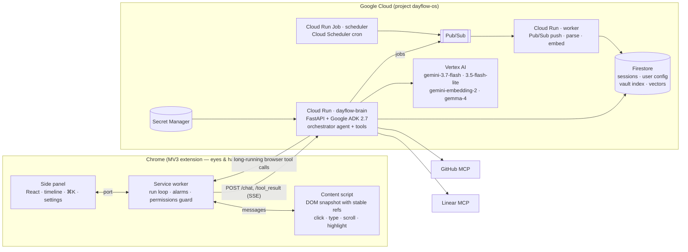

# Dayflow — an agent that lives in your browser and does your student ops

Dayflow is a Chrome side-panel agent with a Gemini brain on Google Cloud. It works the way you already work — signed in to your university portal, Teams, Telegram, GitHub — and automates the multi-step chores around studying: syncing course files into a local vault, generating courseware from a syllabus, bootstrapping project repos, posting team updates and filing issues, building a pitch deck.

It is built like Claude Code, but for the browser and with Gemini: a generic agent loop plus **user-owned configuration** — *skills* (playbooks), *site profiles* (notes per domain), *connections*, *permissions* and *schedules* — all editable in the extension. The university-specific behaviour ships as a default **skill pack**; nothing in the code knows what a specific portal is.

**Track:** The Taskmaster · **Submission:** All Things Agentic Hackathon (Google, 2026)

## What it does (demo scenes)

| # | Skill | What happens |
|---|---|---|
| 1 | **Sync WSP files to vault** | Opens the portal, walks every course's file directory, downloads new/changed files into `Downloads/DayflowVault/<course>/<week or lab>/`, parses them with Gemini and indexes summaries + deadlines in Firestore. Runs on a schedule too. |
| 2 | **Build courseware from syllabus** | Cheatsheet + quiz for the requested weeks, generated as HTML, served from Cloud Run, opened in a tab. |
| 3 | **Scaffold vault folders** | Per course / per week / per lab folder tree derived from the syllabi. |
| 4 | **Bootstrap coding project** | Creates a GitHub repo with a working foundation, notebook and `TODO.md` via the GitHub MCP server. |
| 5 | **Team ops** | Drafts the weekly update from commits, opens Telegram Web, finds the team chat, asks for confirmation, posts; files Linear issues (Linear MCP); opens a GitHub issue + PR. |
| 6 | **Pitch deck from repo** | Builds a `.pptx` from README/TODO, saves it to the vault, uploads it to Drive and opens it in Slides. |

Every run streams into the side panel as a timeline: model text, each tool call with its result and timing, artifacts, and **Allow / Deny** cards for anything outward-facing.

## Architecture



**How a run works.** The panel posts the skill's prompt to `/chat`. The ADK orchestrator composes its instruction from the user's config (base prompt + active skill + site profiles for the domains in scope + permissions) and streams events over SSE. When the model calls a *browser* tool, ADK's long-running-tool mechanism ends the turn; the extension executes the call (`read_page`, `click`, …), and posts the result to `/tool_result`, which resumes the same invocation. Each HTTP exchange is short and instance-agnostic, so the brain scales to zero. Server tools (document parsing, embeddings, GitHub/Linear via `McpToolset`) run inside the brain.

**Why this shape.** One image, three runtimes split by workload (interactive brain · async worker · cron), not by model — models are chosen per role in `backend/dayflow/models/models.yaml`. State lives in Firestore (ADK's `FirestoreSessionService` for conversations, our collections for config and the vault index). The extension is deliberately thin so the same brain can run on Cloud Run or on `localhost`.

**Safety model.** Permissions are enforced twice: in the brain (`before_tool_callback` navigation allow-list, confirmation credits for `ask_before` tools) and in the extension (URL scheme + allow-list on every navigation, vault-confined download paths, client-side confirmation gate). Outward actions (`request_confirmation`) render as Allow/Deny cards. `/pubsub` and `/cron` verify Google OIDC tokens; the extension's bearer token can't call them.

## Google Cloud usage (hackathon gates)

| Requirement | Where |
|---|---|
| Gemini 3.5+ via Vertex AI | `gemini-3.7-flash` orchestrator, `gemini-3.5-flash-lite` parser, `gemini-embedding-2` (768-d), Gemma 4 classifier — `backend/dayflow/models/models.yaml`, `GOOGLE_GENAI_USE_ENTERPRISE=1` |
| Google Agent Framework | Google ADK 2.7 (`LlmAgent`, `LongRunningFunctionTool`, `McpToolset`, callbacks, `FirestoreSessionService`) — `backend/dayflow/agents/`, `backend/dayflow/tools/` |
| Cloud infrastructure | Cloud Run (brain, worker), Cloud Run Job (scheduler), Firestore, Pub/Sub, Secret Manager |

## Repository layout

```
extension/            Chrome MV3 extension (WXT · React 19 · Tailwind 4 · TypeScript)
  entrypoints/        background.ts (run loop, alarms) · content.ts (eyes & hands) · sidepanel/
  src/protocol.ts     wire protocol + user config model (skills, sites, connections, permissions)
  src/agent/          adk.ts (ADK event adapter, SSE) · live.ts (tool loop) · tools.ts (browser tools)
                      guard.ts (client-side permissions) · cron.ts + scheduler.ts · mock.ts (scripted demo)
  src/ui/             Home · RunView · Settings · CommandPalette · design tokens
  scripts/shots.mjs   Playwright screenshots of every panel state (design loop)
backend/              Python 3.12 · uv · Google ADK 2.7 · FastAPI
  dayflow/core/       config models · pack loader (YAML default pack + Firestore overlay)
  dayflow/models/     role → model registry
  dayflow/agents/     orchestrator (instruction composition, guards, confirmation credits)
  dayflow/tools/      browser (long-running) · server (parse, embed) · connectors (GitHub/Linear MCP)
  dayflow/api/        FastAPI app · auth · OIDC · pubsub push
  dayflow/workers/    Pub/Sub job handlers        dayflow/scheduler.py  Cloud Run Job entrypoint
  tests/              pytest (real ADK runner with scripted LLM, API, guards, workers)
Makefile              verify · dev-brain · dev-extension · deploy-brain
```

## Run it from zero

Prerequisites: Node 20+, pnpm 10, Python 3.12 via [uv](https://docs.astral.sh/uv/), Google Cloud SDK, a GCP project with billing.

### 1. Backend — locally

```bash
cd backend
uv sync
cp .env.example .env            # fill in: GOOGLE_CLOUD_PROJECT, DAYFLOW_TOKEN (any random string)
gcloud auth application-default login
make -C .. dev-brain            # http://localhost:8080  (GET /health, /docs)
```

Local mode uses in-memory sessions unless `DAYFLOW_FIRESTORE=1`. Gemini is called through Vertex AI with your Application Default Credentials.

### 2. Backend — Google Cloud

```bash
PROJECT=<your-project> REGION=europe-west4
gcloud config set project $PROJECT
gcloud services enable run.googleapis.com firestore.googleapis.com pubsub.googleapis.com \
  aiplatform.googleapis.com secretmanager.googleapis.com cloudbuild.googleapis.com artifactregistry.googleapis.com
gcloud firestore databases create --location=$REGION
openssl rand -base64 32 | tr -d '\n' | gcloud secrets create dayflow-token --data-file=-
SA=$(gcloud projects describe $PROJECT --format='value(projectNumber)')-compute@developer.gserviceaccount.com
for r in roles/aiplatform.user roles/datastore.user roles/secretmanager.secretAccessor; do
  gcloud projects add-iam-policy-binding $PROJECT --member=serviceAccount:$SA --role=$r; done
make deploy-brain PROJECT=$PROJECT REGION=$REGION      # prints the *.run.app URL
```

Optional vector index for the vault: `gcloud firestore indexes composite create --collection-group=chunks --query-scope=COLLECTION --field-config field-path=embedding,vector-config='{"dimension":"768","flat":"{}"}'`.

### 3. Extension

```bash
cd extension
pnpm install
pnpm build                       # → .output/chrome-mv3
```

`chrome://extensions` → *Developer mode* → *Load unpacked* → `extension/.output/chrome-mv3`. Click the toolbar icon to open the panel. Settings → *Advanced*: set **Mode = live**, paste the token (`gcloud secrets versions access latest --secret dayflow-token`), and the backend URL (`*.run.app` or `http://localhost:8080`). Mock mode plays every skill scripted without a backend.

Connections (optional, for scenes 4–5): set `GITHUB_TOKEN` (PAT with repo/issues/PR scopes) and `LINEAR_API_KEY` on the brain; the MCP toolsets register automatically.

### Verify

```bash
make verify      # ruff + pyright + pytest (backend) · tsc + vitest (extension)
```

## Configuration model

| Setting | Meaning | Claude Code analogue |
|---|---|---|
| **Skills** | id, prompt, instructions, allowed tools, sites, cron schedule; import/export as JSON packs | slash commands / skills |
| **Sites** | per-domain notes the agent reads when working there | `CLAUDE.md` per repo |
| **Connections** | GitHub, Linear, Drive, Telegram — tokens live in the backend | MCP servers |
| **Permissions** | navigation allow-list; "always ask before" sending messages / opening PRs / downloading | allow / deny lists |
| **Schedules** | skill × cron → `chrome.alarms`; notifications when a background run ends | hooks / cron |

## Costs

Cloud Run scales to zero with request-based billing; Firestore and Pub/Sub sit inside free tiers at this scale. Gemini Flash models keep a typical skill run in the low-cent range. Nothing needs to stay running between demos.

## Roadmap

- Google sign-in (`chrome.identity`) and BYOK / AI Studio-linked per-user auth replacing the shared token
- OAuth "Connect" flows for GitHub / Linear / Drive
- Attendance tracking + GPA projection, Teams digest, opportunity scanner (skills in the same pack)
- Screenshot + Gemini computer-use fallback for canvas UIs (Canva)
