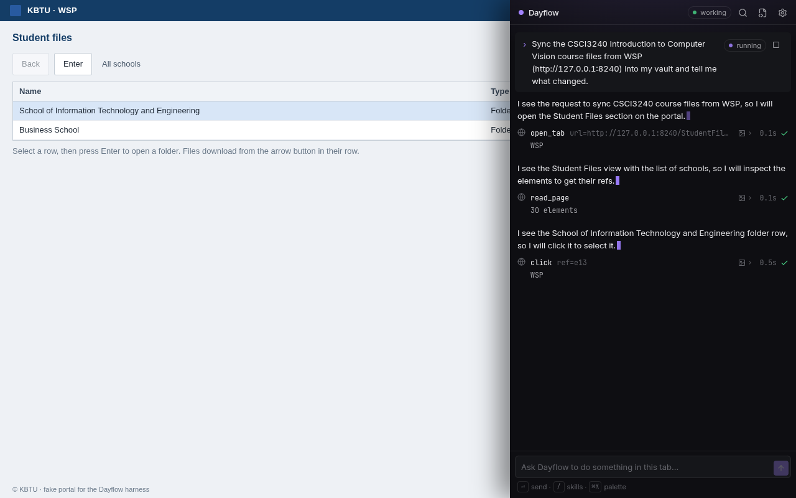
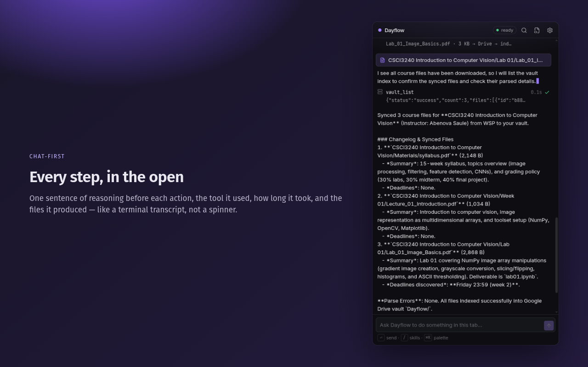
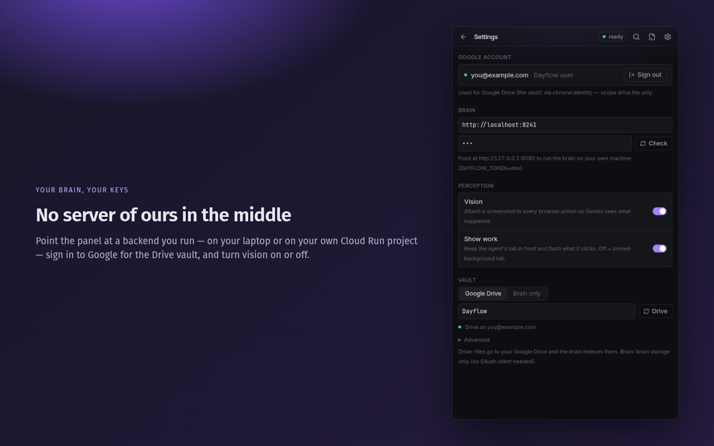
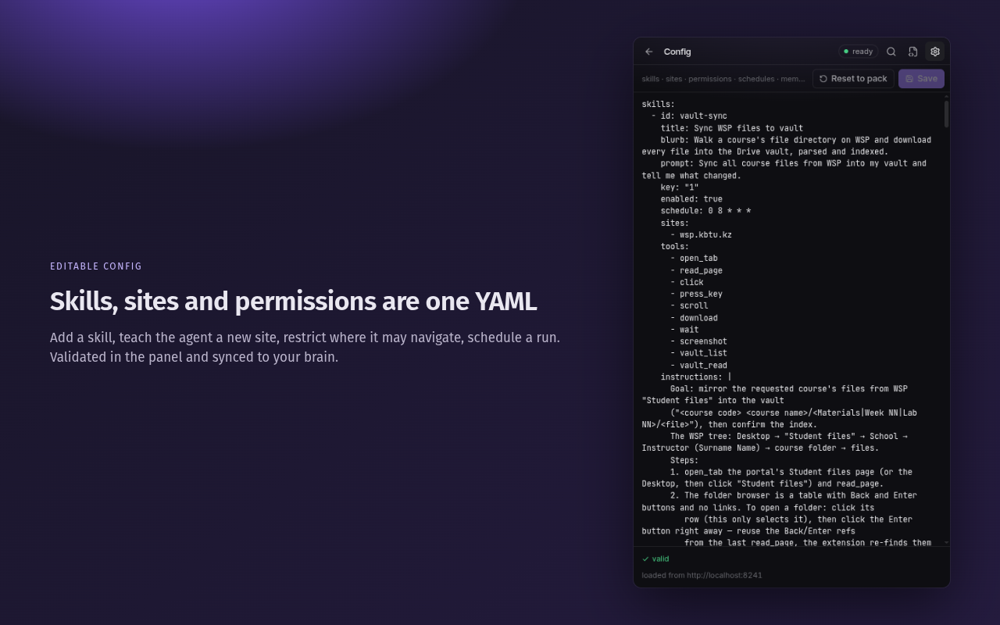
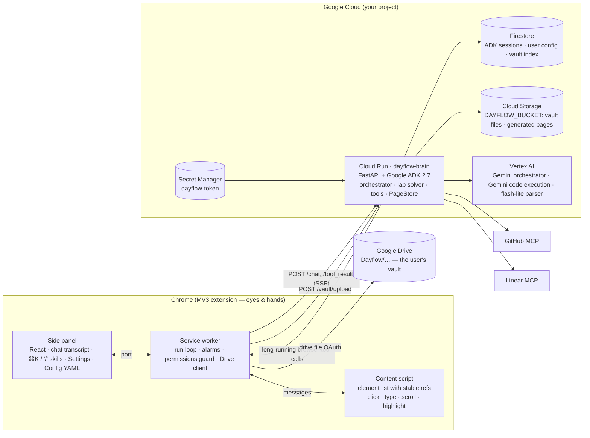

# Dayflow — a browser agent on Gemini, with the config you own

[](../../actions/workflows/ci.yml)
[](LICENSE)

Dayflow is a Chrome side-panel agent with a Gemini brain (Google ADK on Cloud Run). It works where you already work — signed in to your university portal, your team chat, GitHub — and runs multi-step chores end to end: syncing course files into your Google Drive vault, **solving** a lab into a runnable notebook and a private repo, posting the weekly update to the team chat and filing the issues and the PR.

It is built like a coding agent, but for the browser: a generic loop plus **user-owned configuration** — *skills* (playbooks), *site profiles* (notes per domain, with a perception mode), *permissions* (navigation allow-list, ask-before gates), *connections* and *schedules*. Everything university-specific ships as a default **skill pack** (`backend/dayflow/core/packs/kbtu-student.yaml`); nothing in the code knows what a specific portal is. Delete the pack and you still have the agent.

- **Track:** The Taskmaster · **Submission:** All Things Agentic Hackathon (Google, 2026)
- **Demo video:** _TBD — 4-minute walkthrough; the link goes here before submission_
- **In a hurry?** → **[docs/JUDGES.md](docs/JUDGES.md)** — a 10-minute evaluation path, with the command that proves each claim.
- **How it is built:** **[docs/ARCHITECTURE.md](docs/ARCHITECTURE.md)** — components, sequence diagrams, trust boundaries.

```bash
git clone <repo> && cd <repo>
make verify                       # ruff + pyright + pytest · tsc + vitest · node --test — no credentials needed
make e2e SCENE=vault-sync         # watch Gemini drive a real Chromium against a synthetic portal
```

## Screenshots

Captured at 1280×800 for the Chrome Web Store listing; `make e2e` writes the same views live to
`harness/out/<scene>/shots/`.

| | |
|---|---|
|  |  |
| A run in progress: reasoning sentence, tool row, screenshot thumbnail, artifacts. | Chat-first — type a task, or `/` to pick a skill. |
|  |  |
| One Settings screen: brain URL + token, perception, Google account, vault mode. | The whole agent — skills, sites, permissions, schedules — as editable YAML. |

## What it does (the six skills)

Verdicts below are read from `harness/out/<scene>.json` — the machine-checked result of the last
`make e2e` run (2026-08-26). Each spec is adversarial: the notebook is *re-executed*, the `.pptx` is
unzipped and its slides counted, the Drive copy is compared byte-for-byte with the page the brain served.

| # | Skill | What Gemini does | Verdict | Actions | Wall |
|---|---|---|---|---|---|
| 1 | **Vault sync** | Opens the portal, walks School → Instructor → course folder, downloads every file into Drive `Dayflow/<course>/<Materials\|Week NN\|Lab NN>/`; the brain parses each (title, summary, deadlines) and indexes it. Also runs on a schedule. | ✅ pass | 14 | 2m38s |
| 2 | **Lab** | Reads the lab PDF from the vault and **solves** it: a sub-agent with Gemini code execution writes and runs the code per task, assembles a notebook with real outputs, writes a report, creates a private GitHub repo and pushes README/TODO/notebook/report. | ✅ pass | 14 | 5m21s |
| 3 | **Team ops** | Summarises the week from the repo, opens the messenger, finds the team chat, asks you to approve the exact text, sends it; files Linear issues; opens a GitHub issue **and** a pull request. | ✅ pass | 4 | 2m42s |
| 4 | **Courseware** | Cheatsheet + 10-question quiz page built from the syllabus, opened in a tab and saved to the vault. | ✅ pass | 17 | 2m59s |
| 5 | **Scaffold** | Week/lab folder tree in Drive derived from the syllabus' 15-week schedule. | ✅ pass | 13 | 3m06s |
| 6 | **Pitch deck** | A real `.pptx` (16:9, ≥6 slides) built from the repo plus an HTML preview, saved to the vault. | ✅ pass | 3 | 1m33s |

Honest notes:

- **Fake external systems, real Gemini.** The harness stands in for the portal, Google Drive, GitHub and
  Linear so a judge needs no accounts. The model, the loop, the guards, the parsing, the code execution and
  the generated artifacts are the production ones.
- **Scene 1 also passes against the real portal** (`E2E_REAL=1`, a signed-in Chromium profile,
  `wsp.kbtu.kz`): 40 browser actions on a 15-lecture course (the cap is now 60; one earlier run failed at 41 under the old 40). Those results are
  never committed (they contain real course content), so this line is a claim you can only re-run, not read.
- **Scenes 2–6 have not been run against the real GitHub/Linear MCP servers** — set `GITHUB_TOKEN` /
  `LINEAR_API_KEY` on the brain and the same tool names go to the real `McpToolset` instead of the fakes.
- **The deployed Cloud Run revision is only as new as the last `make deploy-brain`.**
  `make deploy-smoke PROJECT=…` says whether the v2 routes (`/vault`, `/pages`, `/config`) are live on it.

## How the loop works

The panel posts your prompt to `/chat`. The ADK orchestrator composes its instruction from *your* config
(base prompt + memory + the active skill, or every skill as a playbook + the site profiles in scope with
their `dom`/`vision` mode + your permissions) and streams events over SSE.

Browser tools are ADK `LongRunningFunctionTool`s that return `None`, so ADK does not invent a result: the
turn simply **ends** with the call pending. The extension executes it, attaches a JPEG of the tab when
*Vision* is on, and `POST /tool_result` resumes the same session. Every exchange is short and
instance-agnostic, which is why the brain runs at `min-instances 0`.

A real trace, copied from `harness/out/vault-sync.json → steps[]`:

```
text   I will open the Student Files section on the student portal to browse the available course materials.
tool   open_tab   url=…/StudentFiles                 ok   2947 ms
text   I see the Student Files page listing schools, so I will read the page to get element references.
tool   read_page                    30 elements      ok     44 ms
text   I see the row for School of Information Technology and Engineering, so I will select it.
tool   click      ref=e13                            ok   4855 ms
text   I see the school row selected, so I will click the Enter button to open the folder.
tool   click      ref=e6                             ok    448 ms
text   I see the list of instructors in the school folder, so I will read the page…
tool   read_page                    38 elements      ok     39 ms
…      download ×3 → Drive + POST /vault/upload → parsed + indexed → vault_list() to confirm
```

One sentence of reasoning before **every** action is a rule in the prompt, not a post-hoc summary — it is
what makes a 40-action run readable, and what tells you *why* the agent clicked the thing it clicked.

Server-side tools run inside the brain and never touch the browser: vault (`vault_list` / `vault_read`, PDF
parsing with Gemini Flash-Lite), the lab solver (`solve_lab_task` — an `LlmAgent` with
`BuiltInCodeExecutor`, wrapped as an `AgentTool`), `build_notebook` / `build_report` / `generate_courseware`
/ `plan_vault_folders` / `build_deck` (each rendering a page at `/pages/<kind>/<id>`), and GitHub + Linear
through `McpToolset` — or in-process fakes when `DAYFLOW_FAKE_CONNECTORS=1`.

## Architecture

Full component map, two sequence diagrams (a browser round-trip and a `download` → Drive → index resume)
and the trust boundaries: **[docs/ARCHITECTURE.md](docs/ARCHITECTURE.md)**.



**Vault.** Two modes, chosen in Settings → Vault. *Google Drive*: the extension uploads each file to your own
Drive (`chrome.identity`, scope `drive.file` — Dayflow can only see files it created) **and** posts the bytes
to `POST /vault/upload` so the brain can parse and index them (Firestore `users/{uid}/vault/{id}`, bytes in
`DAYFLOW_BUCKET`). *Brain only*: no OAuth client needed (judges, CI) — files live in your brain and are
listed at `GET /vault`.

## Safety model

Permissions are enforced **twice**, on both sides of the wire, because either side alone can be talked out of it.

In the brain (`before_tool_callback`, `backend/dayflow/agents/orchestrator.py`):

- host allow-list for `navigate` / `open_tab` / `download(url=…)` — the brain's own host is implicitly allowed
  for the pages it generates, and nothing else is;
- a hard cap of **60 browser actions per run**, reset only by a new user prompt;
- **bound approvals**: a tool in `ask_before` (`type`, `create_issue`, `issue_write`, `create_pull_request`,
  `run_js`) only runs when the user allowed a `request_confirmation` card whose text covers exactly the
  content the call sends — the message text, the issue title and body, the JS expression. One approval is
  spent by one call, so the model cannot get consent for a draft and then send something else.

In the extension (`src/agent/guard.ts`, `confirm.ts`, `tools.ts`):

- URL scheme + allow-list on every URL the model passes **and on the tab every action targets** — the
  active-tab fallback, redirects and links that leave the site are refused;
- downloads re-checked after redirects; vault-confined paths;
- `run_js` printed in full in the transcript and gated by an Allow card when it can move data;
- password / card / one-time-code input values masked in `read_page` before they can reach the model.

Around them: page content is declared **untrusted data, never instruction**, in the system prompt.
Model-written lab code runs in Gemini's sandbox — the brain refuses to run notebooks locally on Cloud Run
(`K_SERVICE` set) unless `DAYFLOW_LOCAL_EXEC=1`. `/pubsub` and `/cron` verify Google OIDC tokens, so the
extension's bearer token cannot call them. And the user id comes from the credential, never from the client:
the shared `DAYFLOW_TOKEN` (→ user `local`), one of `DAYFLOW_USERS` (sha256 → user id), or — when
`GOOGLE_OAUTH_CLIENT_ID` is set on the brain — a Google **ID token** verified against that client id, whose
`sub` becomes the user id. (The extension still sends the shared token: `chrome.identity.getAuthToken`
yields an OAuth *access* token, never an ID token, so the JWT path is there for clients that have one.)

Nothing is scraped or stored outside your own Google Cloud project and your own Drive. There are no
credentials in this repository, and no real personal data: every name in `harness/fake-wsp/tree.json` is
invented and the PDFs are generated.

## Google Cloud usage (hackathon gates)

| Requirement | Where |
|---|---|
| **Gemini** via Vertex AI | orchestrator, lab solver (**Gemini code execution**), Flash-Lite document parser, embeddings — roles pinned in `backend/dayflow/models/models.yaml`, `GOOGLE_GENAI_USE_ENTERPRISE=1`; `/health` reports the configured backend |
| **Google agent framework** | Google ADK 2.7.1 — `LlmAgent`, `LongRunningFunctionTool` (the whole browser loop), `AgentTool` + `BuiltInCodeExecutor` (the lab solver), `McpToolset` (GitHub/Linear), `before_tool_callback` guards, `FirestoreSessionService`, SSE streaming |
| **Cloud infrastructure** | **Cloud Run** (the brain, scale-to-zero), **Firestore** (ADK sessions + events, user config, vault index), **Cloud Storage** (vault bytes + generated pages), **Secret Manager** (bearer token), **Cloud Build** (deploy from source) |
| Also wired, not yet demoed | **Pub/Sub** push (`POST /pubsub`) and **Cloud Scheduler** (`POST /cron`) handlers exist and verify Google OIDC, but no Make target creates the topic/job yet — background runs are driven by `chrome.alarms` today |

## Run it from zero

Prerequisites: **Node ≥ 22.18** (the harness imports the extension's TypeScript natively), **pnpm 10**,
[**uv**](https://docs.astral.sh/uv/) (installs Python 3.12 itself), and — for anything that calls Gemini —
the Google Cloud SDK with a project that has Vertex AI enabled and billing on.

### 1. Brain — locally

```bash
cd backend && uv sync
cp .env.example .env            # set GOOGLE_CLOUD_PROJECT=<your project>; GOOGLE_GENAI_USE_ENTERPRISE=1; DAYFLOW_TOKEN=dev
gcloud auth application-default login
cd .. && make dev-brain         # loads backend/.env → http://localhost:8080
curl localhost:8080/health
```

`/health` must say `"gemini": {"backend": "vertex", "project": …}`; `unconfigured` means the env file was not
loaded. Locally the brain uses in-memory sessions and an in-memory vault unless `DAYFLOW_FIRESTORE=1` and
`DAYFLOW_BUCKET=<bucket>` are set.

Every environment variable the brain reads (`backend/.env.example` is the copy-me version):

| Variable | Default | Meaning |
|---|---|---|
| `DAYFLOW_TOKEN` | — | shared bearer token the extension sends; maps to user `local` |
| `DAYFLOW_USERS` | — | `sha256(token)=user_id,…` — multi-user tokens; the matching digest picks the user id |
| `GOOGLE_OAUTH_CLIENT_ID` | — | when set, a Google **ID token** is also accepted as the bearer; its `sub` is the user id |
| `GOOGLE_GENAI_USE_ENTERPRISE` | `0` | `1` = Gemini through Vertex AI with ADC (what Cloud Run uses) |
| `GOOGLE_CLOUD_PROJECT` / `GOOGLE_CLOUD_LOCATION` | — / `global` | the Vertex project and region |
| `GOOGLE_API_KEY` | — | alternative to Vertex for local dev (Gemini API) |
| `DAYFLOW_MODEL_<ROLE>` | from `models.yaml` | override one role, e.g. `DAYFLOW_MODEL_ORCHESTRATOR` |
| `DAYFLOW_FIRESTORE` | `0` | `1` = ADK sessions, user config and the vault index in Firestore |
| `DAYFLOW_BUCKET` | memory | Cloud Storage bucket for vault bytes and generated pages |
| `DAYFLOW_PUBLIC_URL` | learned | base URL of the `/pages` links; learned from the first request only from loopback or `*.run.app` |
| `GITHUB_TOKEN` / `LINEAR_API_KEY` | — | enable the GitHub / Linear MCP toolsets |
| `DAYFLOW_FAKE_CONNECTORS` / `DAYFLOW_FAKE_LOG` | `0` | in-process GitHub/Linear stubs + the JSONL call log (the harness) |
| `DAYFLOW_LOCAL_EXEC` | `0` | allow local notebook execution; refused on Cloud Run (`K_SERVICE`) without it |
| `PUBSUB_TOPIC` / `PUBSUB_PUSH_SA` / `CRON_INVOKER_SA` / `OIDC_AUDIENCE` / `PUBSUB_VERIFY` | — | Pub/Sub and Cloud Scheduler identities the OIDC check requires |
| `PORT` | `8080` | uvicorn port (Cloud Run sets it) |

### 2. Brain — Google Cloud

```bash
PROJECT=<your-project> REGION=europe-west4
gcloud config set project $PROJECT
gcloud services enable run.googleapis.com firestore.googleapis.com storage.googleapis.com \
  aiplatform.googleapis.com secretmanager.googleapis.com cloudbuild.googleapis.com artifactregistry.googleapis.com
gcloud firestore databases create --location=$REGION
openssl rand -base64 32 | tr -d '\n' | gcloud secrets create dayflow-token --data-file=-
SA=$(gcloud projects describe $PROJECT --format='value(projectNumber)')-compute@developer.gserviceaccount.com
for r in roles/aiplatform.user roles/datastore.user roles/secretmanager.secretAccessor roles/storage.objectAdmin; do
  gcloud projects add-iam-policy-binding $PROJECT --member=serviceAccount:$SA --role=$r; done
make deploy-brain PROJECT=$PROJECT REGION=$REGION   # creates gs://$PROJECT-dayflow-vault, deploys, sets DAYFLOW_PUBLIC_URL, smoke-tests
```

`deploy-brain` derives the service accounts from the project number and the public URL from the deployed
service — nothing in the Makefile is tied to the author's project. Re-check any time with
`make deploy-smoke PROJECT=$PROJECT`: it prints `/health` (bucket + Gemini backend) and the status of
`GET /vault` and `GET /config` with the token.

### 3. Extension

```bash
cd extension && pnpm install && pnpm build      # → extension/.output/chrome-mv3
```

`chrome://extensions` → *Developer mode* → *Load unpacked* → `extension/.output/chrome-mv3`. Click the
toolbar icon to open the side panel, then **Settings**:

- **Brain** — the backend URL (`https://….run.app` or `http://localhost:8080`) and the token
  (`gcloud secrets versions access latest --secret dayflow-token`, or `dev` locally). *Check* pings `/health`
  and `/config`. There is no default URL: paste yours.
- **Perception** — *Vision* (attach a screenshot to every action) and *Show work* (keep the agent's tab in front).
- **Google account** — *Sign in with Google* (`chrome.identity`, scope `drive.file` only) stores the account
  e-mail; *Sign out* drops the cached OAuth token. A token that expires mid-run is refreshed once and the
  Drive call retried.
- **Vault** — *Google Drive* (needs the sign-in above **and** an OAuth client id at build time) or
  *Brain only* (nothing to configure — start here).
- **Config** (its own view) — the brain's YAML: skills, sites, permissions, schedules, memory. Skills are not
  shipped in the extension; the panel shows what `GET /config` returns, validates your edits and `PUT`s them
  back. *Reset to pack* restores the default pack.

Then type a request in the composer, or `/` (or ⌘K) to pick a skill.

**Connections for scenes 2, 3 and 6:** set `GITHUB_TOKEN` (a PAT with repo/issues/PR scopes) and
`LINEAR_API_KEY` on the *brain*; the MCP toolsets register themselves at start-up. Without them,
`DAYFLOW_FAKE_CONNECTORS=1` gives in-process stubs with the same tool names — which is what the harness uses.

**Build-time configuration (optional).** Exactly one variable is read at build time. Copy
`extension/.env.example` to `extension/.env` (gitignored), or just create it with:

```ini
# OAuth 2.0 client id of type "Chrome Extension" from your Google Cloud project, Drive API enabled,
# scope https://www.googleapis.com/auth/drive.file. A client id is public by design; a Chrome extension
# has no client secret — never put one here. Register the client against the id the build produces
# (the `key` in wxt.config.ts pins the unpacked build to a stable id; a store build gets a new one).
VITE_GOOGLE_CLIENT_ID=
```

WXT inlines it into `manifest.oauth2.client_id`, so changing it needs a rebuild and a reload. Leave it unset
and nothing breaks: Settings shows *Drive not configured*, the sign-in button is disabled and the vault falls
back to **Brain only**. Nothing else is configured at build time — the backend URL and token are per-user
runtime settings you type into the panel, never baked into a build.

**Dev build vs store package.** `pnpm build` writes a *development* manifest carrying the `key` field — the
public half of a signing pair that pins the unpacked extension to a stable id, which is what a Google OAuth
client must be registered against. A Chrome Web Store package must **not** contain it (the store assigns the
id itself), so `pnpm zip:store` (`DAYFLOW_STORE_BUILD=1 wxt zip`) builds the same code with `key` omitted;
`pnpm build:store` does the same without zipping. The private key is not in the repo.

### Verify

```bash
make verify      # ruff + pyright + pytest (backend) · tsc + vitest (extension) · node --test (fake Drive)
```

No credentials, no network calls to Google — every test runs against in-process fakes. This is exactly what
CI runs on every push (`.github/workflows/ci.yml`).

## Harness (`make e2e`)

Nothing real is touched. `harness/` is a **synthetic stand-in** for every external system, so a judge can run
the whole loop without accounts:

- `harness/fake-wsp/` — a static Vaadin-like portal (`/StudentFiles`: School → Instructor → course → files,
  with generated PDFs; `/StudentSchedule`; `/News`; `/chat`, a messenger page standing in for Telegram Web).
  It is deliberately hostile to scripting — no hrefs, click-to-select rows, a separate *Enter* button — because
  the real one is. Every instructor and student name in `tree.json` is invented.
- `harness/fake-drive.mjs` — a Drive v3 subset (`files?q=`, folder create, multipart upload **and** PATCH
  replace, `alt=media`) writing a real folder tree under `harness/out/drive/<scene>/`. Its own upload
  semantics are self-tested (`node --test harness/fake-drive.test.mjs`) because a wrong PATCH once corrupted
  a PDF.
- `DAYFLOW_FAKE_CONNECTORS=1` — in-process GitHub/Linear stubs named exactly like the MCP tools
  (`create_repository`, `push_files`, `issue_write`, `create_pull_request`, `list_teams`, `create_issue`, …)
  logging JSON lines to `harness/out/<scene>-connectors.jsonl`.
- `harness/run.mjs` — Playwright launches a persistent Chromium with the built extension, seeds the
  extension's settings (backend = the local brain, Drive = fake Drive, a fake OAuth token, the portal on the
  allow-list — the brain host deliberately **not** on it, so the "brain pages are still navigable" rule is
  exercised), opens the side panel, types the scene prompt, auto-clicks *Allow* on confirmation cards, waits
  for the run to end (8-minute cap) and judges the result with `harness/specs/<scene>.mjs`.

Only Gemini is real: the brain runs locally against **Vertex AI in your project** with your Application
Default Credentials.

```bash
gcloud auth application-default login
export GOOGLE_CLOUD_PROJECT=<your project>       # else the active gcloud project is used, and it says so
make e2e-setup                                   # pnpm install + Playwright Chromium + backend venv (once)
make e2e SCENE=vault-sync                        # one scene;  make e2e → all six
```

A preflight fails fast with the missing item (uv, Node version, the extension build, Playwright's Chromium,
ADC/project). Ports: fake-wsp on `E2E_PORT_BASE` (8099), the brain on BASE+1, fake-drive on BASE+2 — set
`E2E_PORT_BASE` to run scenes side by side. Headed Chromium is the default when a display exists
(`HARNESS_HEADLESS=1` otherwise, set automatically without `$DISPLAY`). The lab scene re-executes the pushed
notebook with `uv run --script harness/lib/nbcheck.py` (uv builds a venv with nbclient/ipykernel/numpy;
network needed the first time). `E2E_REAL=1` runs scene 1 against the real portal from an already signed-in
profile — the runner never logs in and never types credentials, and the prompt comes from `HARNESS_PROMPT`
so no real course or instructor name is ever committed.

Reading a result — `harness/out/<scene>.json` (the six fake-scene files are committed; everything else under
`harness/out/` is machine-local and gitignored):

```
pass            true when failures is empty
status          done | error | cancelled | timeout | harness-error
failures[]      every unmet expectation, in words (e.g. "create_issue calls: 0, expected ≥1")
steps[]         the transcript: text / tool (name, args, summary, ms, status) / artifact / confirm rows
actions         browser actions executed (cap 60) · refusedActions: calls the brain's guard refused
toolCalls       call count per tool · connectorCalls: the fake GitHub/Linear log · confirms: cards and answers
drive.entries   the fake-Drive tree · vault: GET /vault from the brain · chatDom: messages visible on /chat
notebook        (lab) code cells, cells with outputs, and whether a fresh nbclient execution succeeded
spec, specSha256, runnerSha256   which spec/runner produced the file — a stale JSON is detectable
```

Screenshots of the panel and every tab go to `harness/out/<scene>/shots/`; the brain's log is
`harness/out/brain-<scene>.log`.

## Configuration model

| Setting | Meaning | Coding-agent analogue |
|---|---|---|
| **Skills** | id, prompt, step-by-step instructions, allowed tools, sites, cron schedule; live in the brain's pack + your overlay | slash commands / skills |
| **Sites** | per-domain notes plus a perception mode (`dom` = element list with refs, `vision` = screenshot + coordinates) | per-repo instructions |
| **Connections** | GitHub, Linear (tokens on the brain), Google Drive (OAuth in the extension) | MCP servers |
| **Permissions** | navigation allow-list; ask-before gates for messages, issues/PRs, `run_js` | allow / deny lists |
| **Schedules** | skill × cron → `chrome.alarms`; a notification when a background run ends | hooks / cron |
| **Memory** | free-form notes the agent reads at run start (your repo, your portal) | project memory |

## Repository layout

```
extension/            Chrome MV3 extension (WXT 0.21 · React 19 · Tailwind 4 · TypeScript)
  entrypoints/        background.ts (run loop, alarms, config sync) · content.ts (eyes & hands) · sidepanel/
  src/protocol.ts     wire protocol + settings model (sites, permissions; skills come from the brain)
  src/agent/          adk.ts (ADK event adapter, SSE) · live.ts (tool loop) · tools.ts (browser tools + Drive/vault upload)
                      guard.ts (client-side permissions) · confirm.ts · drive.ts · identity.ts · sync.ts · cron.ts · scheduler.ts
  src/ui/             Chat · Timeline · Composer · CommandPalette · Settings · Config (YAML editor)
backend/              Python 3.12 · uv · Google ADK 2.7 · FastAPI
  dayflow/core/       config models · pack loader (YAML default pack + per-user overlay) · vault · pages
  dayflow/agents/     orchestrator (instruction composition, guards, approvals) · lab_solver (code execution)
  dayflow/tools/      browser (long-running) · server (vault, parse) · lab · scaffold · courseware · deck · connectors
  dayflow/api/        FastAPI app · auth · OIDC · vault · pages · deck · pubsub
  tests/              pytest (guards, API with a scripted runner, tools, connectors, scenes)
harness/              synthetic stand-ins + Playwright runner (see "Harness")
  fake-wsp/           static Vaadin-like portal (tree.json → generated PDFs; all names invented) + /chat messenger
  fake-drive.mjs      Drive v3 subset writing a real folder tree under harness/out/drive/<scene>/
  run.mjs · e2e.sh    scene runner (seeds the extension, drives the panel, judges with specs/<scene>.mjs)
  specs/              per-scene expectations · lib/nbcheck.py re-executes the pushed notebook
docs/                 ARCHITECTURE.md (diagrams) · JUDGES.md (10-minute path)
Makefile              verify · dev-brain · deploy-brain · deploy-smoke · e2e · e2e-setup
```

## Costs

Cloud Run scales to zero with request-based billing, so the brain costs nothing between demos; Firestore and
Cloud Storage stay inside their free tiers at this scale. The variable cost is Gemini, and the harness
measures the shape of it per run (`toolCalls` in each scene JSON): **vault-sync** 15 tool calls in 16 model
turns, **courseware** 20, **scaffold** 16, **team-ops** 14, **pitch-deck** 6 — and **lab** is the expensive
one at 25, five of which are `solve_lab_task` calls that each write *and execute* code in Gemini's sandbox.
Every browser tool result also carries a JPEG of the tab while Vision is on. With the Flash-tier models pinned in
`backend/dayflow/models/models.yaml` a run of any single skill is a cents-scale event; multiply by
[Vertex AI pricing](https://cloud.google.com/vertex-ai/generative-ai/pricing) for your region if you need the
exact figure. Turning *Vision* off removes the screenshot from every tool result and is the biggest lever.

## Roadmap

- Chrome Web Store packaging (unlisted first — `<all_urls>` + `scripting` + `identity` mean manual review)
  with the unpacked zip in GitHub Releases as the judge path.
- Google ID-token auth on the brain replacing the shared token; OAuth *Connect* flows for GitHub and Linear
  instead of tokens in env.
- Cloud Scheduler + Pub/Sub deploy targets so background runs survive a closed browser.
- A sandboxed executor (Cloud Run Job, no service account, egress blocked) for notebook verification in
  production.
- More skills in the same pack, no new code: attendance tracking and GPA projection, a Teams digest,
  an opportunity scanner over the channels you already read.

## License

MIT — see [LICENSE](LICENSE). © 2026 Altair Zhambyl.
