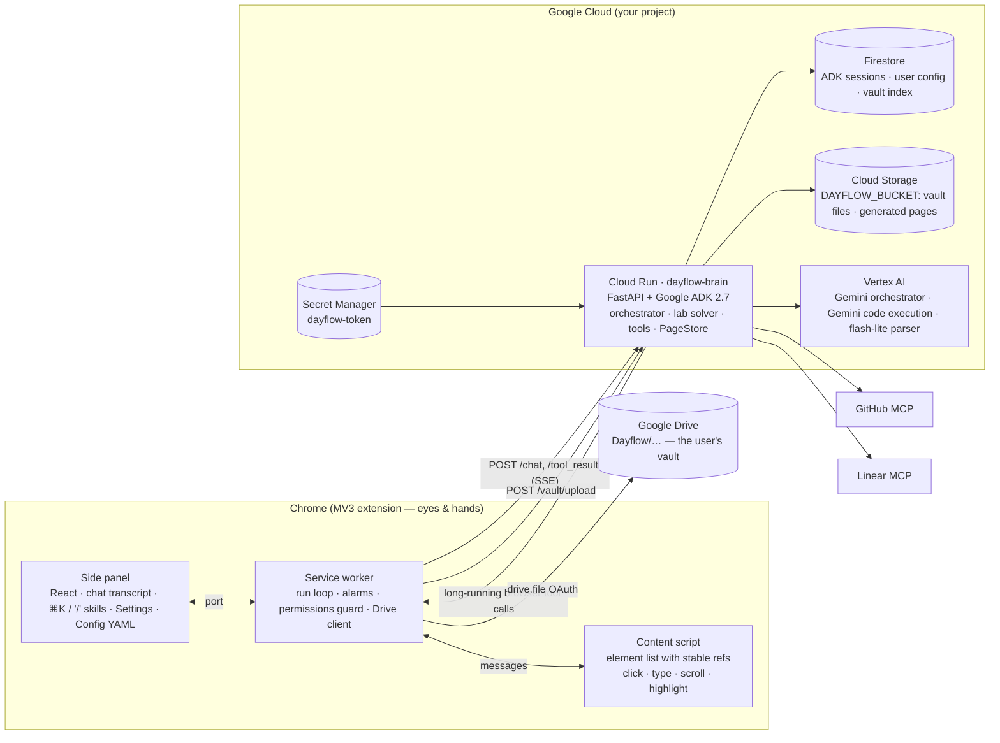
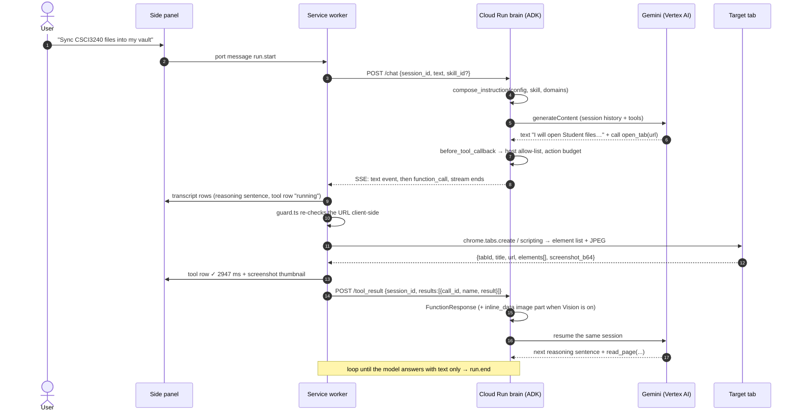
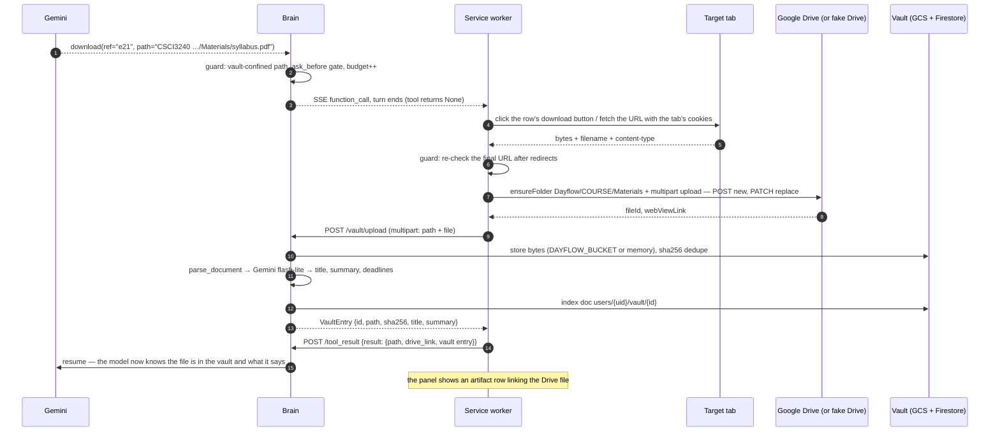

# Architecture

Dayflow is a **generic browser agent**: a Gemini loop in the cloud plus eyes and hands in Chrome. Nothing
in the code knows what a university portal is — the university-specific part is a YAML *skill pack*
(`backend/dayflow/core/packs/kbtu-student.yaml`) that the user can edit in the side panel.

Two processes, one loop:

- **Brain** — Python 3.12, Google ADK 2.7, FastAPI, on Cloud Run. Owns the model, the instruction, the
  permission guard, the vault index and every tool that does not need a browser.
- **Hands** — Chrome MV3 extension (WXT · React 19 · TypeScript). Owns the tab, the DOM, the screenshots,
  the user's Google Drive token and the Allow/Deny cards. It holds no prompts and no skills.

The brain never talks to a browser and the extension never talks to Gemini. They meet on two HTTP endpoints.

## Components

| Piece | File | Responsibility |
|---|---|---|
| Instruction composer | `backend/dayflow/agents/orchestrator.py` (`compose_instruction`) | base prompt + memory + active skill (or all skills as playbooks) + site profiles in scope with their `dom`/`vision` mode + permissions |
| Guard | same file (`guard_tool`, `before_tool_callback`) | host allow-list, 60-action budget, bound approvals |
| Browser tools | `backend/dayflow/tools/browser.py` | `LongRunningFunctionTool`s that return `None` — declarations only; the extension executes them |
| Server tools | `backend/dayflow/tools/{server,lab,scaffold,courseware,deck,connectors}.py` | vault read/list, notebook + report, folder plans, courseware, `.pptx`, GitHub/Linear (MCP or in-process fakes) |
| Lab solver | `backend/dayflow/agents/lab_solver.py` | an `LlmAgent` with `BuiltInCodeExecutor`, wrapped as an `AgentTool` (`solve_lab_task`) — Gemini writes *and runs* the code |
| PageStore | `backend/dayflow/core/pages.py`, `GET /pages/{kind}/{id}` | HTML the agent generates (report, cheatsheet+quiz, deck preview), served from the brain |
| Vault | `backend/dayflow/core/vault.py`, `POST /vault/upload`, `GET /vault` | bytes in `DAYFLOW_BUCKET` (or memory), index in Firestore, parsed on upload (title, summary, deadlines) |
| Run loop | `extension/entrypoints/background.ts` + `src/agent/live.ts` | drives `/chat` → tools → `/tool_result` until no calls are pending |
| Tool executor | `extension/src/agent/tools.ts` | tabs, `chrome.scripting`, screenshots, downloads, Drive upload, `POST /vault/upload` |
| Client guard | `extension/src/agent/guard.ts`, `confirm.ts` | scheme + allow-list on every URL *and* on the tab each action targets; Allow/Deny cards |

## One browser tool round-trip

Every browser tool is an ADK `LongRunningFunctionTool` that returns `None`. ADK therefore does **not**
synthesise a function response: the turn ends with the call pending, the SSE stream closes, and the run is
resumed later by `POST /tool_result` with the same `session_id`. Each HTTP exchange is short and stateless,
so Cloud Run can scale to zero between actions and any instance can pick up the next one.

A real trace of exactly this (from `harness/out/vault-sync.json`) is quoted in the README under
*How the loop works*.

## A long-running resume: `download` → Drive → vault index

`download` is the interesting one — it is the only tool whose result travels in three directions: to Drive
(the user's own account), to the brain's vault (so it can be parsed and indexed), and back to the model.

When the user has no Google OAuth client configured (judges, CI), Settings → Vault is **Brain only**: the
Drive leg is skipped and only `POST /vault/upload` runs. The harness points `driveApiBase` at
`harness/fake-drive.mjs`, so both legs are exercised without a Google account.

## Where the state lives

| State | Home | Notes |
|---|---|---|
| Conversation / pending tool calls | ADK session (`FirestoreSessionService`, or in memory locally) | keyed by the panel's `runId` = `session_id` |
| Run budget, granted approvals, active skill | ADK session `state` | `result_state_delta` writes them; the guard reads them |
| User config (skills, sites, permissions, schedules, memory) | Firestore, seeded from the YAML pack | `GET/PUT /config`; the panel edits it as YAML |
| Vault index | Firestore `users/{uid}/vault/{id}` | path, sha256, size, drive_file_id, title, summary, deadlines |
| Vault bytes, generated pages | `DAYFLOW_BUCKET` (Cloud Storage) or process memory | without a bucket a cold start loses the bytes behind a persisted index |
| Settings (backend URL, token, vision, Drive account) | `chrome.storage.local` | never leaves the browser except as the `authorization` header |

## Background runs

Skills carry a cron expression. Two paths exist and both end in the same loop:

- **Chrome side** — `chrome.alarms` (`src/agent/scheduler.ts`) fires, the service worker runs the skill's
  prompt with no panel open (the tab opens in the "Dayflow" tab group in the agent's own window, out of the way) and raises a
  `chrome.notifications` when it ends.
- **Cloud side** — Cloud Scheduler → `POST /cron` (Google OIDC verified against `CRON_INVOKER_SA`) →
  `dayflow/scheduler.py` enqueues jobs; `POST /pubsub` (verified against `PUBSUB_PUSH_SA`) delivers them to
  `dayflow/workers/handlers.py`. The extension's bearer token cannot call either endpoint.

## Trust boundaries

1. **Page content is data, never instruction.** The system prompt says so; `read_page` masks password, card
   and one-time-code values before the text ever reaches the model.
2. **Two independent permission checks.** The brain guards the tool call (host allow-list, 60-action budget,
   bound approvals — an `ask_before` tool only runs when the user allowed a `request_confirmation` whose text
   covers exactly what the call sends, and the approval is spent by that one call). The extension guards the
   execution (URL scheme, allow-list on the URL *and* on the tab being acted on, download re-check after
   redirects, vault-confined paths).
3. **Model-written code runs in Gemini's sandbox**, not on the brain. On Cloud Run (`K_SERVICE` set) the brain
   refuses to execute notebooks locally unless `DAYFLOW_LOCAL_EXEC=1`.
4. **Identity comes from the credential, not from the client.** The bearer is either the shared
   `DAYFLOW_TOKEN` (→ user `local`), one of `DAYFLOW_USERS` (sha256 → user id), or a Google ID token verified
   against `GOOGLE_OAUTH_CLIENT_ID` (its `sub` becomes the user id). A client cannot pick its own user id.
